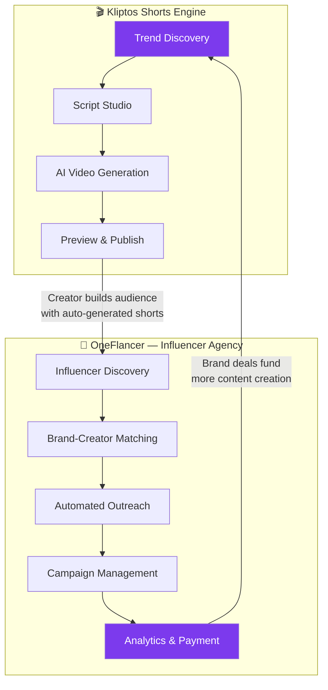

# Kliptos — Master Plan v3
## AI Shorts Automation + Influencer Agency SaaS

> **The only platform that creates your content AND gets brands to pay for it.**

---

## Competitive Intelligence: AutoShorts.ai

### What They Do
AutoShorts.ai automates "faceless" short-form video creation:
- Pick a topic/series → AI generates script → AI adds visuals + voiceover + subtitles → auto-posts to TikTok/YouTube/Instagram
- Fully autopilot mode — minimal user input
- Target: faceless content channels

### What They Charge
- Subscription plans ($29–$99/mo range)
- Credit-based video generation
- Auto-posting included in higher tiers

### Their Weaknesses (Our Opportunities)
| AutoShorts Weakness | Kliptos Advantage |
|:---|:---|
| **Stock footage only** — generic, repetitive visuals | **AI-generated visuals** (Veo 3.1, HiggsField) — cinematic, unique per video |
| **No trend discovery** — user must pick topics manually | **AI trend harvester** — auto-discovers viral topics from Reddit + Google Trends |
| **No monetisation path** — creates content but doesn't help you make money | **OneFlancer** — built-in influencer agency that connects creators with brand deals |
| **No channel analytics** — post and forget | **YouTube analytics dashboard** — track performance, optimise strategy |
| **Basic script generation** — template-driven, repetitive | **Advanced LLM scripts** — GPT-4o with tone controls, segment-level regeneration |
| **No video preview/editing** — what you get is what you get | **Full preview studio** — watch, tweak, approve before publishing |
| **Single platform focus** — mainly YouTube/TikTok | **Multi-platform** — YouTube, TikTok, Instagram Reels (future) |
| **No team/agency features** — solo creator tool only | **Multi-user SaaS** — agencies can manage multiple creators |

---

## The Kliptos Differentiator: Two Products, One Platform



**The flywheel**: Creators use Kliptos to **grow their channel** with AI shorts → OneFlancer **connects them with brands** → Brand revenue **funds more content** → Repeat.

**No other platform does both.** AutoShorts just makes videos. Grin/Upfluence just manage influencers. Kliptos is the first to close the loop.

---

## Complete Feature Set

### Module 1: Shorts Engine (What we've started building)

| Feature | Status | Description |
|:---|:---|:---|
| **Trend Discovery** | 🔶 Stub | Reddit + Google Trends scraping with AI scoring |
| **Script Studio** | 🔶 Stub | GPT-4o script gen with tone controls, visual prompts, segment editing |
| **Voice Synthesis** | 🔶 Stub | edge-tts (free) / ElevenLabs with word-level timestamps |
| **AI Visuals** | 🔶 Stub | Veo 3.1 + HiggsField + Pexels — selectable per video |
| **Video Assembly** | 🔶 Stub | MoviePy composition, Whisper captions, music mixing |
| **Thumbnail Generation** | 🔶 Stub | Pillow-based auto thumbnails |
| **YouTube Upload** | 🔶 Stub | Data API v3 with metadata, scheduling, resumable upload |
| **Video Preview** | 🔶 UI only | In-browser 9:16 player with timeline |
| **Multi-platform Posting** | ❌ New | TikTok + Instagram Reels upload (future phase) |

### Module 2: OneFlancer — Influencer Agency (NEW)

| Feature | Priority | Description |
|:---|:---|:---|
| **Creator Profile** | P0 | Auto-generated media kit from YouTube analytics — followers, engagement rate, niche, demographics |
| **Brand Marketplace** | P0 | Browse available brand deals, filter by niche/budget/requirements |
| **Brand-Creator AI Matching** | P1 | LLM-powered matching — analyses creator content vs brand requirements |
| **Outreach Automation** | P1 | AI-written personalised pitch emails to brands, multi-domain rotation, warm-up |
| **Campaign Dashboard** | P1 | Track active deals: deliverables, deadlines, payments, status |
| **Contract Templates** | P2 | Auto-generated creator agreements with usage rights, payment terms |
| **Payment Escrow** | P2 | Stripe Connect — brands pay into escrow, released on deliverable approval |
| **Performance Reports** | P2 | Post-campaign analytics shared with brands — views, clicks, conversions |
| **Brand Portal** | P3 | Separate login for brands to browse creators, post briefs, manage campaigns |

### Module 3: Platform Infrastructure

| Feature | Status | Description |
|:---|:---|:---|
| **Google OAuth** | 🔶 Stub | Sign in with Google, YouTube channel connection |
| **Role-based Access** | ❌ New | Creator, Brand, Admin roles with scoped permissions |
| **Credit System** | 🔶 Stub | Pre-paid credits with Stripe Checkout |
| **Subscription Tiers** | ❌ New | Free / Pro / Studio with feature gates |
| **Security** | ❌ New | JWT + refresh tokens, rate limiting, CSRF, input sanitisation, encrypted credentials |
| **Admin Panel** | ❌ New | User management, credit adjustments, system health |
| **Email Notifications** | ❌ New | Upload complete, brand match found, payment received |
| **Audit Logging** | ❌ New | Full activity trail for compliance |

---

## Security Architecture

| Layer | Implementation |
|:---|:---|
| **Authentication** | NextAuth.js v5 (Google OAuth) → JWT + httpOnly refresh tokens |
| **Authorisation** | RBAC middleware — Creator/Brand/Admin roles, resource-level permissions |
| **API Security** | Rate limiting (60 req/min/user), CORS whitelist, request size limits |
| **Data Encryption** | AES-256 for stored OAuth tokens (YouTube, Stripe), bcrypt for any passwords |
| **Input Validation** | Pydantic schemas on every endpoint — no raw user input reaches DB |
| **CSRF Protection** | SameSite cookies + CSRF tokens on state-changing endpoints |
| **Secrets Management** | `.env` in dev, cloud-native secrets (Railway/Vercel) in prod — never in code |
| **SQL Injection** | SQLAlchemy ORM (parameterised queries only) |
| **XSS Prevention** | React's default escaping + CSP headers |
| **Dependency Scanning** | `npm audit` + `pip audit` in CI pipeline |
| **YouTube Token Security** | Encrypted at rest, auto-refresh via background job, revoke on disconnect |

---

## User Flows

### Flow 1: Creator — Free Tier
```
Sign up (Google) → Connect YouTube channel → Explore trending topics →
Pick a topic → Generate script (edit if wanted) → Select Pexels (free) visuals →
Generate video → Preview → Publish (watermarked) → 3 credits/month
```

### Flow 2: Creator — Pro Tier ($19/mo)
```
Everything in Free + Veo 3.1/HiggsField visuals → No watermark →
50 credits/month → Schedule posts → Basic analytics →
OneFlancer: Create media kit → Browse brand deals → Apply to campaigns
```

### Flow 3: Creator — Studio Tier ($49/mo)
```
Everything in Pro + 150 credits → Priority rendering → Advanced analytics →
OneFlancer: AI brand matching → Automated outreach → Campaign management →
Payment tracking → Bulk video queue
```

### Flow 4: Brand User
```
Sign up as Brand → Post campaign brief (budget, niche, deliverables) →
AI matches with relevant creators → Review creator media kits →
Approve matches → Track deliverables → Pay via escrow → View performance report
```

---

## Updated Pricing

| Plan | Price | Video Credits | Shorts Engine | OneFlancer |
|:---|:---|:---|:---|:---|
| **Free** | $0 | 3/mo | Pexels only, watermarked | View-only marketplace |
| **Pro** | $19/mo | 50 | All engines, no watermark, scheduling | Media kit, browse & apply to deals |
| **Studio** | $49/mo | 150 | Priority render, bulk queue, analytics | AI matching, auto-outreach, campaign mgmt |
| **Brand** | $29/mo | — | — | Post briefs, browse creators, escrow payments |
| **Top-up** | $5/10 credits | — | — | — |

---

## Deployment Architecture

```
┌──────────────────────────────────────────────┐
│                 Vercel ($20/mo)               │
│   Next.js 15 — Frontend + Auth + Webhooks    │
│   • SSR Dashboard    • Landing Page          │
│   • Server Actions   • Stripe Webhooks       │
└───────────────────┬──────────────────────────┘
                    │ HTTPS
┌───────────────────▼──────────────────────────┐
│            Railway ($20–40/mo)                │
│   ┌──────────┐ ┌───────┐ ┌──────────────┐   │
│   │ FastAPI   │ │ Redis │ │  PostgreSQL   │   │
│   │ API + WS  │ │       │ │              │   │
│   └────┬─────┘ └───┬───┘ └──────────────┘   │
│        │           │                          │
│   ┌────▼───────────▼────────────────┐        │
│   │     Celery Workers (2–4)        │        │
│   │  Video pipeline + outreach jobs │        │
│   └─────────────────────────────────┘        │
└──────────────────────────────────────────────┘
                    │
     ┌──────────────┼──────────────────┐
     ▼              ▼                  ▼
  Cloudflare R2   YouTube API      Stripe
  (video/media    (upload)         (billing)
   $0.015/GB)
```

### Cost Estimate (Launch)

| Service | Monthly Cost |
|:---|:---|
| Vercel Pro | $20 |
| Railway (API + Workers + Redis + Postgres) | $20–40 |
| Cloudflare R2 (100GB storage) | $1.50 |
| Domain + DNS | $1 |
| **Total infrastructure** | **~$45–65/mo** |
| Stripe fees | 2.9% + $0.30 per transaction |
| API costs (OpenAI, Veo) | Pass-through to user via credits |

---

## Updated Project Structure

```
Automation/
├── frontend/                       # Next.js 15
│   └── src/app/
│       ├── (marketing)/            # Landing, pricing, about
│       ├── (auth)/                 # Sign-in, sign-up
│       ├── dashboard/              # Creator dashboard
│       │   ├── topics/             # Trend Explorer
│       │   ├── studio/             # Script Studio
│       │   ├── preview/[id]/       # Video Preview
│       │   ├── uploads/            # Upload Manager
│       │   ├── analytics/          # YouTube Analytics
│       │   ├── oneflancer/         # ← NEW: Influencer Agency
│       │   │   ├── profile/        # Media kit editor
│       │   │   ├── marketplace/    # Brand deals browser
│       │   │   ├── campaigns/      # Active campaigns
│       │   │   ├── outreach/       # Outreach dashboard
│       │   │   └── payments/       # Payment tracking
│       │   ├── settings/
│       │   └── billing/
│       └── brand/                  # ← NEW: Brand portal
│           ├── briefs/             # Create/manage campaign briefs
│           ├── creators/           # Browse & select creators
│           └── campaigns/          # Track active campaigns
│
├── backend/
│   └── app/
│       ├── routers/
│       │   ├── ... (existing)
│       │   ├── oneflancer.py       # ← NEW: Influencer endpoints
│       │   └── brands.py           # ← NEW: Brand endpoints
│       ├── services/
│       │   ├── ... (existing)
│       │   ├── influencer_matcher.py # ← NEW: AI matching
│       │   ├── outreach_engine.py    # ← NEW: Email outreach
│       │   └── media_kit.py          # ← NEW: Auto media kit gen
│       ├── models/
│       │   ├── ... (existing)
│       │   ├── brand.py              # ← NEW
│       │   ├── campaign.py           # ← NEW
│       │   └── media_kit.py          # ← NEW
│       └── pipeline/
│           └── outreach_tasks.py     # ← NEW: Celery outreach jobs
│
└── docker-compose.yml
```

---

## Implementation Phases (Revised)

### Phase 1 ✅ DONE — Foundation
Project scaffold, Next.js + FastAPI + Docker, landing page, dashboard shell.

### Phase 2 — Core Auth & Data (NEXT)
| Task | Priority |
|:---|:---|
| Google OAuth end-to-end (NextAuth ↔ FastAPI JWT) | P0 |
| Database migrations (Alembic) | P0 |
| User registration + profile | P0 |
| YouTube channel OAuth connection | P0 |
| Stripe integration (credit purchase) | P0 |
| Role-based access (Creator/Brand/Admin) | P0 |
| Security hardening (rate limiting, CSRF, encryption) | P0 |

### Phase 3 — Shorts Pipeline (Full Implementation)
| Task | Priority |
|:---|:---|
| Topic Harvester (Reddit + Google Trends — real data) | P0 |
| Script Generator (OpenAI GPT-4o — real API calls) | P0 |
| Voice Synth (edge-tts — real audio output) | P0 |
| Visual Engines (Veo 3.1, HiggsField, Pexels — real clips) | P0 |
| Video Assembler (MoviePy — real rendering) | P0 |
| Thumbnail Maker (Pillow — real thumbnails) | P0 |
| Celery pipeline orchestrator with Redis progress | P0 |
| WebSocket live progress in frontend | P0 |

### Phase 4 — Publishing & Preview
| Task | Priority |
|:---|:---|
| Video preview player (in-browser 9:16) | P0 |
| YouTube upload via Data API v3 | P0 |
| Scheduled publishing | P1 |
| Upload queue management | P1 |
| Multi-platform posting (TikTok, IG) | P2 |

### Phase 5 — OneFlancer MVP
| Task | Priority |
|:---|:---|
| Creator media kit auto-generation | P0 |
| Brand marketplace (browse deals) | P0 |
| Campaign creation (brand side) | P0 |
| AI brand-creator matching | P1 |
| Campaign dashboard (track deliverables) | P1 |
| Basic outreach (creator applies to deals) | P1 |

### Phase 6 — OneFlancer Advanced
| Task | Priority |
|:---|:---|
| Automated email outreach (multi-domain, warm-up) | P1 |
| Stripe Connect escrow payments | P1 |
| Contract template generator | P2 |
| Brand portal (separate login) | P1 |
| Post-campaign performance reports | P2 |

### Phase 7 — Analytics & Intelligence
| Task | Priority |
|:---|:---|
| YouTube analytics dashboard | P1 |
| Content performance tracking | P1 |
| Best posting times analysis | P2 |
| Trend correlation reports | P2 |
| Creator growth metrics | P2 |

### Phase 8 — Polish & Launch
| Task | Priority |
|:---|:---|
| Responsive design (mobile-ready) | P0 |
| Email notification system | P1 |
| Admin panel | P1 |
| Error handling & edge cases | P0 |
| Production deployment (Vercel + Railway) | P0 |
| Domain, SSL, DNS setup | P0 |
| Landing page SEO optimisation | P1 |
| Documentation / help centre | P2 |

---

## Verification Plan

| Phase | How to verify |
|:---|:---|
| Auth | Sign up → sign in → connect YouTube → verify token stored encrypted |
| Pipeline | Pick topic → generate script → render video → play in preview → upload (unlisted) |
| Billing | Purchase credits via Stripe → verify balance → generate video → verify deduction |
| OneFlancer | Create media kit → browse marketplace → apply to deal → track campaign |
| Security | Penetration test: JWT expiry, rate limiting, SQL injection attempt, XSS attempt |
| Deployment | `curl https://api.kliptos.com/api/health` returns 200 |

---

## What Happens Next

> [!IMPORTANT]
> **Your approval needed.** This plan merges the AI Shorts Engine with the OneFlancer Influencer Agency into a single platform. Phase 2 (Auth + Data) is the critical foundation — everything else builds on it. I recommend we build Phases 2–4 first (fully working shorts pipeline), then add OneFlancer in Phases 5–6.

Do you approve this plan? Any features to add/remove/reprioritise?
